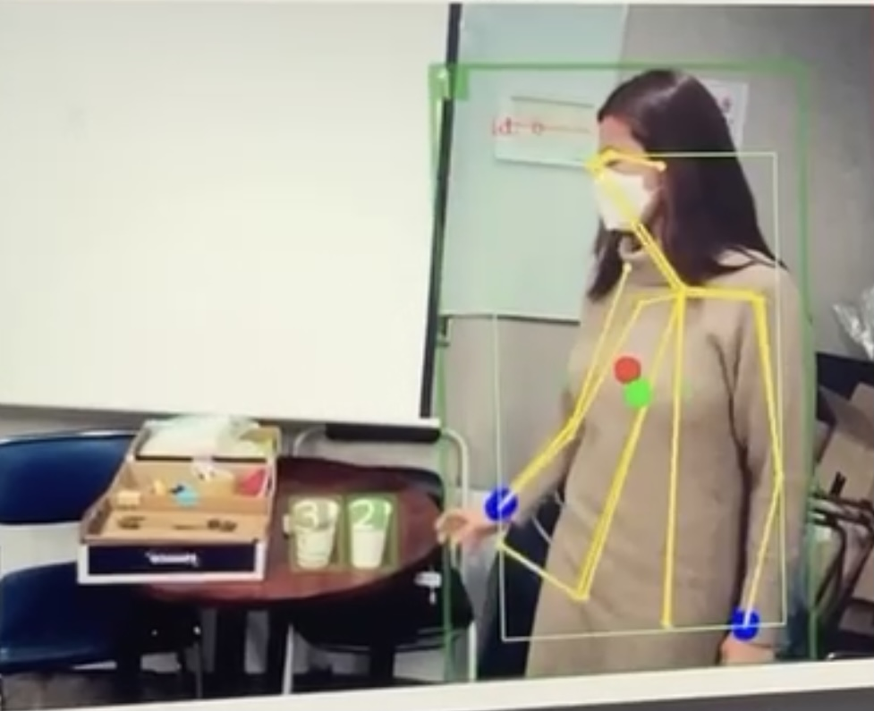

# Grab_N_Go 
## About The Project
Grab N Go is contact free store system mocking AmazonGo.    
Intel Realsense is used for frames from live video stream.  
This code is for object detection using Yolov5 with deepSORT and OpenPose.   
For customer check-in & out system, please check the code here (https://github.com/MinsuKimhero/GrabNGo_CheckInNOut)     

## Environment
* OS: Ubuntu 20.04
* DB: Oracle
* Editor Tool: VSCode
* Language: Python 3.8.5

* GPU : GeForce RTX 2080
* CPU : Intel(R) Core(™) i7-8700 CPU @ 3.20GHz
* CUDA : 11.0
* cudnn : 8.0.5
* Intel Realsense : D455

## Getting Started
To get a local copy up and running follow these simple steps.

### Installation
1. Clone the repo
<pre><code>git clone https://github.com/nire9221/python_grab_n_go.git</code></pre>

2. Install libraries
<pre><code> pip install pytorch numpy opencv-python numba </code></pre>

3. Download pre-trained weights
<pre><code>https://drive.google.com/drive/folders/1BOML8YiJDzZMzbYhb8uOHhz76rMTu4zv?usp=sharing</code></pre>

## Documents 
* [Presentation](https://docs.google.com/presentation/d/1-UXe4Nd7L7BrPOYEuaEXfMdYLZTO0w4LFHUyaZj0GKM/edit?usp=sharing)

## demo
* [Object detection](https://youtu.be/0wqIGQrmuno "object detection")
* [Full video](https://youtu.be/PeilkLjJqE0 "grab n go")
 

## License
Distributed under the MIT License. See LICENSE for more information.

## Contact 
<!-- Actual text -->
You can find me on [![LinkedIn][2.2]][2].
<!-- Icons -->
[1.2]: http://i.imgur.com/wWzX9uB.png (twitter icon without padding)
[2.2]: https://raw.githubusercontent.com/MartinHeinz/MartinHeinz/master/linkedin-3-16.png (LinkedIn icon without padding)
<!-- Links to your social media accounts -->
[1]: https://twitter.com/Martin_Heinz_
[2]: https://www.linkedin.com/in/jinyoung-kang-43478083/

## Reference  
* [Yolov5](https://github.com/ultralytics/yolov5, "Yolov5")  
* [OpenPose](https://github.com/Daniil-Osokin/lightweight-human-pose-estimation.pytorch, "OpenPose")

